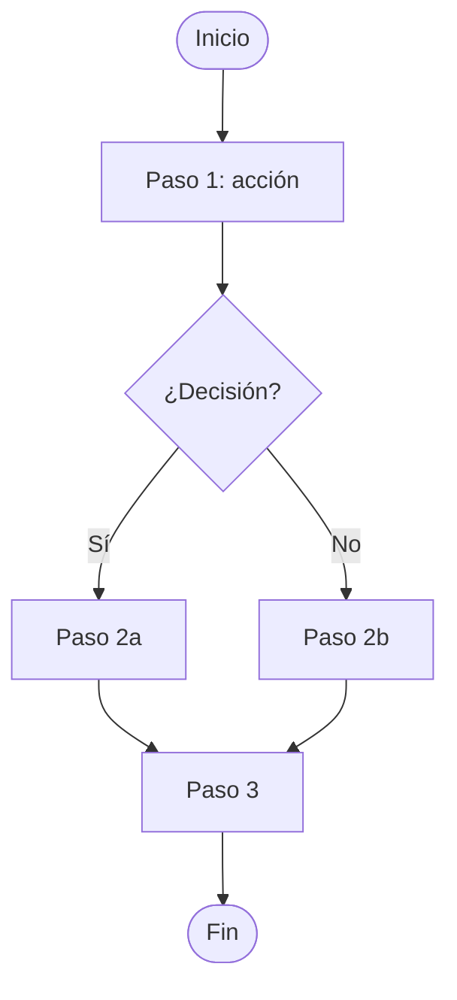
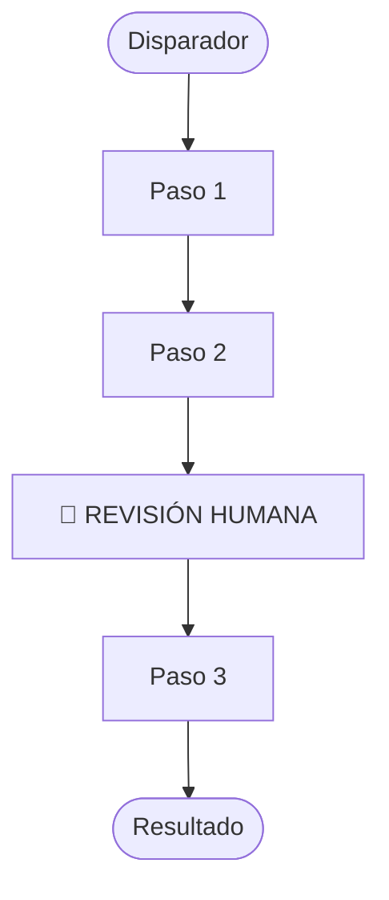
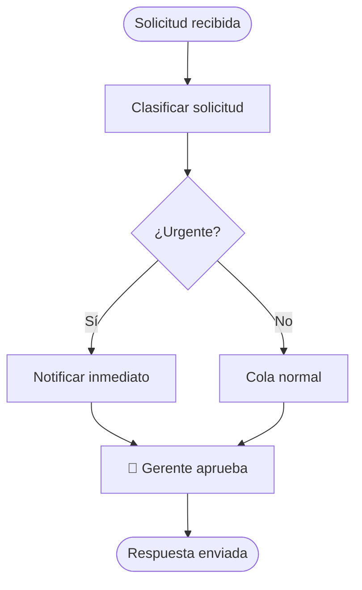
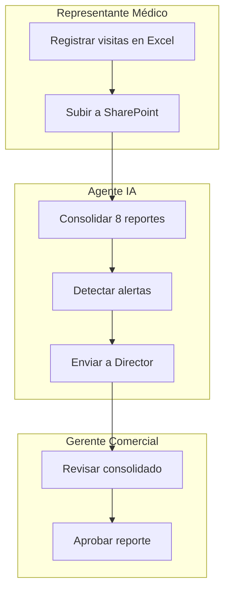
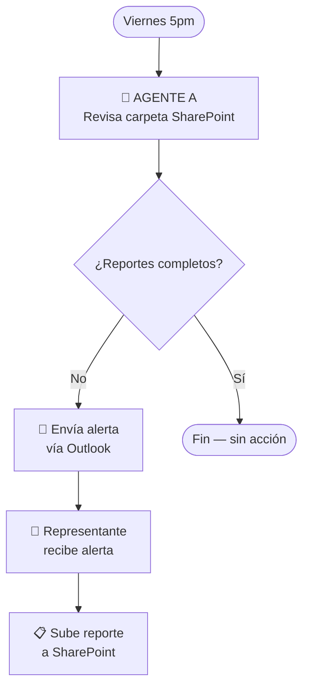

# Guía Mermaid — Diagramas de flujo de procesos

Referencia de sintaxis para generar diagramas de procesos operativos.
Usar flowchart TD (top-down) como default para procesos lineales.
Usar flowchart LR (left-right) para procesos con muchos actores en paralelo.

---

## Estructura básica

---

## Formas y su significado

| Forma | Sintaxis | Uso |
|---|---|---|
| Rectángulo | `[texto]` | Paso o acción |
| Rombo | `{texto}` | Decisión o condición |
| Óvalo | `([texto])` | Inicio o fin del proceso |
| Cilindro | `[(texto)]` | Base de datos o sistema |
| Estadio | `([texto])` | Evento o disparador |
| Nota | Solo texto en el nodo | Aclaración |

---

## Patrones comunes en procesos operativos

### Proceso lineal simple

### Proceso con aprobación

### Proceso con múltiples actores

---

## Convenciones para procesos con IA

Marcar siempre:
- `👤 REVISIÓN HUMANA` en pasos que requieren aprobación
- `🤖 AGENTE IA` en pasos que el agente ejecuta
- `📋 SharePoint` / `📧 Outlook` / `📊 Excel` en pasos que usan sistemas

Ejemplo:

---

## Errores comunes a evitar

- No usar acentos dentro de los nodos (pueden romper el render): usar "accion" no "acción"
- No dejar nodos sin conectar
- No poner más de 8-10 palabras por nodo
- No anidar más de 2 niveles de subgraph
- Siempre cerrar el diagrama con un nodo de Fin
